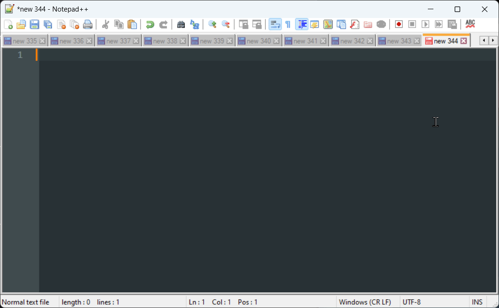

# Voice Typing Assistant

A lightweight Python desktop app for Windows that improves upon Windows Voice Typing (Win+H) by offering superior transcription accuracy and the ability to navigate between windows while recording, all while maintaining a simple, intuitive interface.



## Overview - How it works

- Press `Caps Lock` to begin recording your voice
- A recording indicator with audio level appears on your screen(s) (position and display options configurable)
- You can continue to navigate and type while recording, or click the recording indicator to cancel
- Press `Caps Lock` again to stop recording and process the audio
- The audio is sent to your chosen speech-to-text provider (OpenAI `gpt-4o-transcribe` by default)
- (optional) The transcribed text can be further refined with a quick pass of an LLM model
- The transcribed text is inserted at your current cursor position in any text field or editor

**NOTE:** Hold `Ctrl` while pressing `Caps Lock` if you want to toggle Caps Lock on/off.

## Changelog

See the [CHANGELOG.json](CHANGELOG.json) file for latest changes or the [releases page](https://github.com/Elevate-Code/better-voice-typing/releases) for major releases.

## Features

#### Recording Controls
- **Toggle Recording**: Caps Lock (Ctrl+Caps Lock to toggle Caps Lock on/off)
- **Cancel Recording/Processing**: Click the recording indicator to cancel recording or transcription
- **Copy Last Transcription**: If your cursor was misplaced, left-click tray icon to copy last transcription
- The recording indicator shows elapsed recording time, and recordings auto-stop (and still transcribe) at a configurable maximum duration
- Only one instance of the app can run at a time; launching it again shows a notice instead of a second conflicting instance

### Meeting Mode

Toggle **🎧 Meeting Mode** in the tray menu to capture *both sides of a call*: recordings include your microphone plus system audio (whatever you hear — Meet/Zoom/Teams participants, videos, etc.) as separate channels. Transcripts come back speaker-labeled:

```
Me: So walk me through the pricing concern again?
Them: Well, mainly it's the onboarding fee that feels steep...
```

- Attribution is by audio channel (your mic is always "Me"), not voice-guessing, so it's reliable even with similar voices. Multiple remote speakers share the "Them" label.
- Requires an [ElevenLabs](https://elevenlabs.io) API key: add `ELEVENLABS_API_KEY="..."` to your `.env` (transcription uses Scribe v2 multichannel).
- Labels are configurable via `meeting_speaker_you` / `meeting_speaker_them` in `settings.json`.
- Recording runs as a **continuous session**: the first Caps Lock press starts it, and each following press *sends* everything captured since the last send for transcription while recording keeps rolling — so you can pull the conversation so far into a chat mid-call without losing what's said next. Click the recording indicator (or toggle the mode off) to end the session; audio since your last send is discarded, so press Caps Lock first if you want it.
- Sent chunks transcribe in the background and are inserted at your cursor strictly in order. A failed chunk retries once automatically; if it still fails it's kept for **Retry Last Transcription** in the tray, and the session carries on.
- The first chunk of each session is prefixed with a short bracketed transcript note addressed to whoever reads the paste (typically an AI assistant): voice-to-text mangles proper nouns and attribution, so interpret quietly from context. Disable via `session_preamble: false` in `settings.json`.
- If system-audio capture fails, the recording falls back to normal mic-only dictation.
- The recording indicator turns crimson-pink (instead of red) so you can tell meeting mode is active at a glance.
- Tip: wear headphones; if your mic can hear your speakers, faint echoes of the other side may appear on your channel.

### Phone Mode

Toggle **📞 Phone Mode** in the tray menu for conversations happening *in the room* — a phone call on speaker, an in-person chat — where every voice reaches your microphone. Recording is mic-only (no system audio), and speaker turns are separated by voice diarization onto their own lines:

```
So walk me through the pricing concern again?
Well, mainly it's the onboarding fee that feels steep...
```

- Turns are deliberately *unlabeled* by default: diarization can't know which voice is yours, and its generic "Speaker N" labels are assigned per chunk, so they can swap identities mid-session. Set `phone_speaker_labels: true` in `settings.json` if you want the labels anyway.
- **Stable "Me:" / "Them:" labels via voice matching**: enroll your voice in ElevenLabs' workspace speaker library (dashboard → Speech to Text → Speakers → Add speaker, with 10–60s of your solo audio), then set `phone_my_speaker_id` in `settings.json` to your registered Speaker ID. Words matched to your voice come back with that ID instead of `speaker_N`, so your turns are labeled "Me:" and everyone else "Them:" — consistently across every chunk. Verified at ~98% word accuracy on a 4-speaker meeting recording.
- `phone_diarization_threshold` (default `0.3`) replaces the `phone_num_speakers` hint when set (the API accepts only one). Beyond clustering, it empirically gates speaker-library match *acceptance*: in a seeded sweep the enrolled speaker only matched at ≥ 0.26 (stable through 0.4), while the API's default (~0.22) rejected the match. Set it to `null` to fall back to the `phone_num_speakers` hint (which disables the tuned matching).
- Same continuous-session behavior as Meeting Mode (including the first-chunk transcript note): Caps Lock sends a chunk and keeps recording; click the indicator to end. Each chunk is prefixed with a `--- [chunk N] ---` header marking the discontinuity.
- Requires an [ElevenLabs](https://elevenlabs.io) API key, same as Meeting Mode.
- `phone_num_speakers` in `settings.json` (default `2`) hints the expected speaker count; set it higher for group conversations or `null` to let Scribe decide.
- Meeting Mode and Phone Mode are mutually exclusive — enabling one turns the other off.
- The recording indicator turns violet (instead of red) so you can tell phone mode is active at a glance.

### Streaming Dictation (Beta)

Toggle **Streaming Dictation** under Settings to transcribe *while you speak* over an OpenAI Realtime websocket: text is ready ~1–3 seconds after you stop, regardless of how long the recording was (normally the wait grows with clip length).

- Normal dictation mode only — Meeting and Phone modes keep their batch pipelines (their multi-speaker transcription isn't available in realtime APIs).
- Realtime models trade a little accuracy for speed: each speech segment is transcribed as you go, without the full-recording context the batch model gets. Hence the Beta label — turn it off if you notice quality dips.
- Fail-safe by design: the audio file is still recorded in parallel, and any streaming failure (connection, mid-recording drop, quota) falls back to the normal batch upload automatically.

### Tray Options/Settings
- Retry Last Transcription: Attempts to re-process the last audio recording, useful if the first attempt failed or was inaccurate.
- Recent Transcriptions: Access previous transcriptions, copy to clipboard.
- Microphone Selection: Choose your preferred input device.
- Settings:
  - Clean Transcription: Enable/disable further refinement of the transcription using a configurable LLM.
  - Streaming Dictation (Beta): Transcribe while recording for near-instant results (see above).
  - Silent-Start Timeout: Cancels the recording if no sound is detected within the first few seconds, preventing accidental recordings.
  - Recording Indicator: Customize size, position, and multi-monitor display of the recording indicator.
  - Speech-to-Text: Select your STT provider (OpenAI, Custom/Local) and model (Whisper, GPT-4o, GPT-4o Mini, or custom).
  - Output Mode: Choose how text is inserted (see Plugins below).
  - Open Settings File / Open Logs Folder: Quick access to configuration and logs.
- Restart: Quickly restart the application, like when it's not responding to the keyboard shortcut.

### Tray History
- Keeps track of recent transcriptions
- Useful if your cursor was in the wrong place at the time of insertion
- Quick access to copy previous transcriptions from system tray
- The last 50 transcriptions are also saved (with timestamps) to `Documents\VoiceTyping\history.json`, so nothing is lost across restarts or crashes

### Fine-Tuning (Optional)

While most settings can be controlled from the tray menu, you can fine-tune the application's behavior by editing the settings file at `C:\Users\{YourUsername}\Documents\VoiceTyping\settings.json` (tray icon → Settings → Open Settings File). Older installs kept this file at `modules/settings.json`; it is migrated to the new location automatically on first run.

| Setting | Description | Default | Example Values |
| --- | --- | --- | --- |
| `silent_start_timeout` | Duration in seconds to wait for sound at the beginning of a recording before automatically canceling. Set to `null` to disable. | `4.0` | `2.0` to `5.0` |
| `silence_threshold` | The audio level (RMS) below which sound is considered silence. Lower values are more sensitive. | `0.01` | `0.005` (very quiet) to `0.02` (noisier) |
| `max_recording_duration` | Maximum recording length in seconds; when reached, recording stops automatically and the captured audio is still transcribed. Set to `null` to disable. | `900.0` | `300.0`, `1200.0`, `null` |
| `log_retention_days` | Number of days to keep log files. | `60` | `14`, `90`, `null` (indefinitely) |
| `log_transcript_text` | Whether log files include the transcript text itself. Set to `false` to keep dictated content out of logs. | `true` | `true`, `false` |
| `stt_provider` | The speech-to-text service to use. | `"openai"` | `"openai"`, `"custom"` |
| `custom_stt_base_url` | Base URL for custom/local STT server. | `"http://localhost:8000"` | Any local or remote URL |
| `custom_stt_model` | Model name for custom STT server. | `"parakeet-tdt-0.6b-v2"` | Model supported by your server |
| `openai_stt_model` | The specific model to use for OpenAI's service. `gpt-4o-transcribe` is recommended for highest accuracy. | `"gpt-4o-transcribe"` | `"gpt-4o-transcribe"`, `"gpt-4o-mini-transcribe"` |
| `clipboard_restore_delay_ms` | How long after pasting to wait before restoring your previous clipboard contents. Increase if slow apps paste your old clipboard instead of the transcript. | `300` | `100` to `1000` |

## Technical Details
- Minimal UI built with Python tkinter
- Multi-provider Speech-to-Text support with OpenAI GPT-4o models, Whisper, and custom local/remote servers
- Extensible architecture for adding new STT providers (Azure, local models, etc.)
- Audio is uploaded as FLAC (lossless, roughly half the size of WAV) to reduce latency and stay under API upload limits
- User data (settings, transcription history, logs) lives in `Documents\VoiceTyping`, so app updates never touch it

## Known Issues/Limitations
- For now, only supporting Windows OS and Python 3.10 - 3.12
- When using `gpt-4o-transcribe`, the end of a transcription may occasionally be cut off - this is a [known model issue](https://community.openai.com/t/gpt-4o-transcribe-truncates-the-transcript/1148347). A workaround is in place to minimize this, but if it occurs, use the Retry Last Transcription and see the [Troubleshooting Guide](TROUBLESHOOTING.md).
- When using the `gpt-4o-transcribe` model to transcribe spoken instructions, sometimes it responds to them or carries them out.
- Untested update mechanism ([let me know if it doesn't work](https://github.com/jason-m-hicks/better-voice-typing/issues))
- Recordings may not produce transcriptions if your microphone's audio level is too low
- OpenAI's API has a 25MB upload limit (roughly 20 minutes of audio with FLAC compression); recordings auto-stop at `max_recording_duration` (15 minutes by default) and are still transcribed

## Troubleshooting

For solutions to common problems, see the [**Troubleshooting Guide**](TROUBLESHOOTING.md).

You can find detailed application logs in `C:\Users\{YourUsername}\Documents\VoiceTyping\logs`.

## Using Custom/Local Speech-to-Text

The Voice Typing Assistant supports connecting to custom Speech-to-Text servers, whether local or remote. This allows you to:
- Use locally running models for privacy
- Connect to custom STT servers
- Use alternative STT providers not directly integrated
- Run OpenAI-compatible APIs locally

(As an example you can use parakeet+fastapi docker: `docker run -d -p 8000:8000 viktor742/openapi-parakeet-tdt-0.6b-v2:0.2.1`)

### Configuration

1. **Via Settings Menu**: Right-click the tray icon → Settings → Speech-to-Text → Provider → Select "Custom STT"

2. **Via settings.json**: Edit `Documents\VoiceTyping\settings.json` (tray icon → Settings → Open Settings File):
```json
{
  "stt_provider": "custom",
  "custom_stt_base_url": "http://localhost:8000",
  "custom_stt_model": "parakeet-tdt-0.6b-v2"
}
```

3. **Changing the URL and Model**:
   - `custom_stt_base_url`: Set this to your STT server's base URL (e.g., `http://localhost:8000`, `http://192.168.1.100:5000`)
   - `custom_stt_model`: Set this to the model name your server expects (optional, depends on server)

### Compatible Servers

The custom provider works with various endpoint formats:
- OpenAI-compatible endpoints at `/v1/audio/transcriptions`
- Simple endpoints at `/transcribe` or `/api/transcribe`

The server should accept:
- A multipart form POST request
- A field named `file` containing the audio data (WAV format)
- Returns JSON with the transcription in one of these formats:
  - `{"segments": [{"text": "transcribed text"}]}` (segmented format)
  - `{"text": "transcribed text"}` (OpenAI format)
  - `{"transcription": "transcribed text"}` (alternative format)

### Optional Authentication

If your server requires authentication, set the `CUSTOM_STT_API_KEY` environment variable in your `.env` file:
```
CUSTOM_STT_API_KEY="your-api-key-here"
```

## Plugins (Output Providers)

You can customize how transcribed text is inserted by creating output provider plugins.

### Plugin Location

Plugins are Python files placed in:
```
C:\Users\{YourUsername}\Documents\VoiceTyping\plugins\
```

This directory is created automatically on first run.

### Creating a Plugin

Create a `.py` file that defines a class inheriting from `OutputProvider`:

```python
# Example: chunked_terminal.py
import time
import pyautogui
import pyperclip
from modules.output_providers import OutputProvider

class ChunkedTerminalOutputProvider(OutputProvider):
    """Pastes text in chunks for terminals that truncate large pastes"""

    name = "chunked_terminal"
    display_name = "Chunked Terminal"

    def insert_text(self, text, pyautogui_lock, root_after):
        chunk_size = 500
        with pyautogui_lock:
            original = pyperclip.paste()
            for i in range(0, len(text), chunk_size):
                pyperclip.copy(text[i:i + chunk_size])
                pyautogui.hotkey('ctrl', 'v')
                if i + chunk_size < len(text):
                    time.sleep(1.5)
            root_after(100, lambda: pyperclip.copy(original))
```

### Using Your Plugin

1. Place your plugin file in the plugins directory
2. Restart the application
3. Right-click tray icon → Settings → Output Mode → Select your provider

Plugin errors are logged to `Documents\VoiceTyping\logs` and shown briefly on startup.

## Setup/Installation - For Users

### Quick Start (Windows)

* Requires Python 3.10 - 3.12 (check with `python --version`) - get from [python.org](https://python.org)
* Requires `uv` CLI tool (check with `uv --version`) - get from [uv installation guide](https://docs.astral.sh/uv/getting-started/#installation)

1. Download this project by clicking the green "Code" button at top of page → "Download ZIP" or clone the repo
2. Extract the ZIP file to a location of your choice
3. Run `setup.bat` from Command Prompt or PowerShell:
   - Open Command Prompt or PowerShell (run `cmd` or `powershell` in the search bar)
   - Navigate to the folder: `cd "path\to\extracted\better-voice-typing"`
   - Run: `setup.bat` (Command Prompt) or `.\setup.bat` (PowerShell)
   - This will create a virtual environment, install packages, and set up default configuration
   - If you encounter any installation issues, please [report them](https://github.com/Elevate-Code/better-voice-typing/issues)
4. Open the `.env` file in Notepad, update the following and save:
   - OpenAI API key ([get one here](https://platform.openai.com/api-keys))
   - (Optional) Anthropic API key for text cleaning
5. Launch the application by double-clicking the `run_voice_typing.bat` file in the application folder
6. 💡 Ensure the app's tray icon is visible by right-clicking the taskbar → "Taskbar settings" → "Select which icons appear on the taskbar" → Toggle on for Voice Typing Assistant
7. Right-click `run_voice_typing.bat` → Send to → Desktop to create a shortcut

**(Optional) Fine-tune transcript cleaning**

GPT-4o-transcribe is usually accurate enough that an extra cleaning pass isn't necessary.
If you still want to use the post-processing feature:

1. After the first run, open `settings.json`.
2. Update the `"llm_model"` value to any provider/model [supported by LiteLLM](https://docs.litellm.ai/docs/providers) (eg. `anthropic/claude-3-5-haiku-latest`).
3. Save the file and restart the application.

### Auto-start with Windows
To make the app start automatically when Windows boots:
1. Press `Win + R` on your keyboard
2. Type `shell:startup` and press Enter
3. Create a shortcut to `run_voice_typing.bat` in this folder:
   - Right-click `run_voice_typing.bat` → "Copy"
   - Navigate to the startup folder
   - Right-click in an empty area → "Paste shortcut" (might be under more options)

### Updating the App
To update to the latest version:
1. Open Command Prompt or PowerShell
2. Navigate to the folder: `cd "path\to\better-voice-typing"`
3. Run: `setup.bat` (Command Prompt) or `.\setup.bat` (PowerShell)
4. Choose 'Y' when asked to check for updates
5. The tool will automatically:
   - Download the latest version
   - Preserve your settings and API keys
   - Update all dependencies
6. Restart the app if it was running

## Setup/Installation - For Developers

1. Clone the repo
2. Ensure you have `uv` installed (see [uv installation guide](https://docs.astral.sh/uv/getting-started/#installation))
3. Create a virtual environment with `uv venv --python ">=3.10,<3.13"`
4. Activate with `.venv\Scripts\activate`
5. Install dependencies with `uv pip install -r requirements.txt`
6. Create a `.env` file based on `.env.example` by running `cp .env.example .env`
7. Set up your API keys:
   - Get an OpenAI API key from [OpenAI's API Keys page](https://platform.openai.com/api-keys)
   - (Optional) Get an Anthropic API key if you want to use the text cleaning feature
   - Add these keys to your `.env` file
8. Run the app from the command line:
   ```
   .\.venv\Scripts\python.exe .\voice_typing.pyw
   ```
9. For debugging: Add the `--debug` flag when executing:
   ```
   .\.venv\Scripts\python.exe .\voice_typing.pyw --debug
   ```

## TODO/Roadmap

Want to request a feature or report a bug? [Create an issue](https://github.com/Elevate-Code/better-voice-typing/issues)

- [x] Review and validate setup and installation process
- [x] Add support for OpenAI's [new audio models](https://platform.openai.com/docs/guides/audio)
- [x] Update and improve README.md
- [x] Some warning or auto-stop if recording duration is going to be too long (due to 25MB API limits) — auto-stops at `max_recording_duration` and still transcribes
- [x] Support local whisper (or other) models via the Custom STT provider and a local API server
- [x] Performance profiling and lightweight audio compression — uploads are FLAC-encoded, deferred heavy imports at startup
- [ ] Add support for more speech-to-text providers (Azure, Deepgram, etc.)
- [ ] Customizable activation shortcuts for recording control
- [ ] Since text cleaning isn't needed with gpt-4o-transcribe, pivot it to be "post-processing" and allow user to customize the prompt
- [ ] Add user-configurable translation mode (eg. "English to {language}")
- [ ] Add user-configurable post-processing mode (eg. "Turn my rambling thoughts into an elegant email")
- [ ] Improved transcription accuracy via VLM for code variables, proper nouns and abbreviations using screenshot context and cursor position

## Contributing

TBD, for now, just create a pull request and start a conversation.

## License

This project is licensed under the MIT License - see the [LICENSE](LICENSE) file for details.